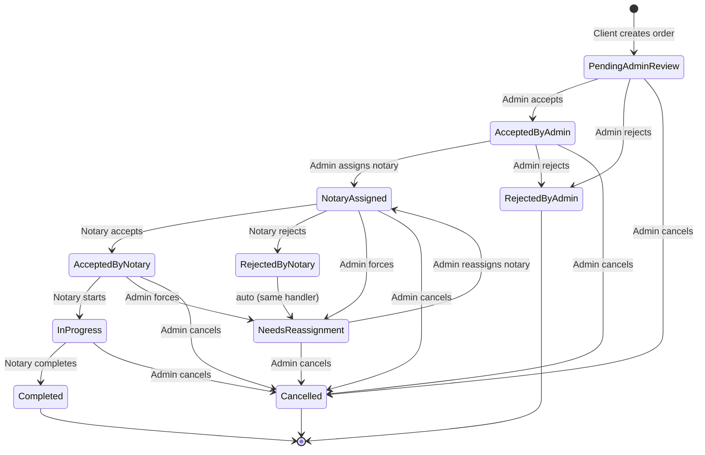

# Notarix — Order Flow Diagram

This document maps every legal state transition for an Order, the role that triggers it, the API route, and any preconditions or side effects. The state machine lives in `src/modules/orders/order-workflow.service.js` and is enforced by `canTransitionOrderStatus()` / `assertTransitionOrFail()`.

---

## Status Enumeration

| Status | Type | Meaning |
|---|---|---|
| `Pending Admin Review` | Intermediate | Just created; awaiting admin decision. |
| `Accepted By Admin` | Intermediate | Admin approved; awaiting notary assignment. |
| `Rejected By Admin` | **Terminal** | Admin rejected at intake. |
| `Notary Assigned` | Intermediate | Admin assigned a notary; awaiting notary response. |
| `Accepted By Notary` | Intermediate | Notary accepted; not yet started. |
| `Rejected By Notary` | Transient | Set for one tick by `reject` handler, immediately moved to `Needs Reassignment`. Never persisted. |
| `Needs Reassignment` | Intermediate | Admin must pick a new notary. |
| `In Progress` | Intermediate | Notary has started the signing/job. |
| `Completed` | **Terminal** | Job done. Triggers payout timer. |
| `Cancelled` | **Terminal** | Admin cancelled. |

Two parallel fields are tracked on the Order but do **not** drive the workflow state machine:

- `paymentStatus` — set by `/admin/orders/:id/payment-status` (admin only). Affects billing, not lifecycle.
- `documents[].status` — `Pending | Verified | Rejected`, set per-document by admin.

---

## State Diagram (Mermaid)



---

## Every Transition (table)

| # | From | To | Triggered by | Route | Preconditions | Side effects |
|---|---|---|---|---|---|---|
| T1 | — | Pending Admin Review | Client | `POST /site/orders` | actor.role = Client | `notifyAdmins("new order")`, `syncPaymentFromOrder`, emit `order_status_updated("created")`, audit `order.created` |
| T2 | Pending Admin Review | Accepted By Admin | Admin | `PATCH /admin/orders/:id/accept` | `assertTransitionOrFail` + `assertVerifiedOrderDocuments` (≥1 doc, all Verified) | clear `adminReviewReason`, emit `order_status_updated`, email `order-accepted`, notify client, audit `order.accepted` |
| T3 | Pending Admin Review | Rejected By Admin | Admin | `PATCH /admin/orders/:id/reject` | `assertTransitionOrFail` | set `adminReviewReason`, clear `notaryId`, emit `order_status_updated` + `assignment_updated("rejected")`, email `order-rejected`, notify client, audit `order.rejected` |
| T4 | Accepted By Admin | Notary Assigned | Admin | `PATCH /admin/orders/:id/assign-notary` | `assertTransitionOrFail` + `assertVerifiedOrderDocuments` + notary exists & not Suspended | set `notaryId`/`notary`/offer/payout/notes, `ensureOrderConversation`, notify notary + client, email `notary-assignment`, emit `assignment_updated("assigned")`, audit `order.notary_assigned` |
| T5 | Accepted By Admin | Rejected By Admin | Admin | `PATCH /admin/orders/:id/reject` (manual fallback) | same as T3 | same as T3 |
| T6 | Notary Assigned | Accepted By Notary | Notary | `PATCH /site/notary/orders/:id/accept` | order belongs to this notary, `current.status === "Notary Assigned"` (hard-coded) | emit `order_status_updated` + `assignment_updated("accepted")`, notify admins, audit `order.notary_accepted` |
| T7a | Notary Assigned | Rejected By Notary | Notary | `PATCH /site/notary/orders/:id/reject` | `assertTransitionOrFail("Rejected By Notary")` | writes history entry, then immediately T7b |
| T7b | Notary Assigned (effectively) | Needs Reassignment | Notary (same handler) | `PATCH /site/notary/orders/:id/reject` | — | clear `notaryId`, notify admins to reassign, emit `assignment_updated("rejected")`, audit `order.notary_rejected` |
| T8 | Notary Assigned | Needs Reassignment | Admin | `PATCH /admin/orders/:id/status` body `{status:"Needs Reassignment"}` | `canTransitionOrderStatus` | clear `notaryId`, emit `order_status_updated`, notify client, audit `order.status_updated` |
| T9 | Accepted By Notary | In Progress | Notary | `PATCH /site/notary/orders/:id/start` | `assertTransitionOrFail("In Progress")` | emit `order_status_updated` + `assignment_updated("started")` |
| T10 | Accepted By Notary | Needs Reassignment | Admin | `PATCH /admin/orders/:id/status` | same as T8 | same as T8 |
| T11 | In Progress | Completed | Notary | `PATCH /site/notary/orders/:id/complete` | `assertTransitionOrFail("Completed")` + `completedDocuments.length > 0` | set `payoutDueDate = now + payoutReleaseDays`, emit `order_status_updated` + `assignment_updated("completed")`, email `order-completed`, notify client + admins, audit `order.completed` |
| T12 | In Progress | Completed | Admin (override) | `PATCH /admin/orders/:id/status` body `{status:"Completed"}` | same as T11 | same as T11 |
| T13 | any non-terminal | Cancelled | Admin only | `PATCH /admin/orders/:id/status` body `{status:"Cancelled"}` | `canTransitionOrderStatus` | clear `notaryId` (if any), emit `order_status_updated`, notify client, audit `order.status_updated` |
| T14 | Needs Reassignment | Notary Assigned | Admin | `PATCH /admin/orders/:id/reassign-notary` | `current.status === "Needs Reassignment"` | same as T4 (with two history entries: one for leaving `Needs Reassignment`, one for arriving `Notary Assigned`) |

---

## Three Happy Paths

### Path A — Smooth, no reassignment
```
Pending Admin Review
  → Accepted By Admin          (T2, admin accepts)
  → Notary Assigned            (T4, admin assigns)
  → Accepted By Notary         (T6, notary accepts)
  → In Progress                (T9, notary starts)
  → Completed                  (T11, notary completes)
```

### Path B — Notary declines once
```
Pending Admin Review
  → Accepted By Admin          (T2)
  → Notary Assigned            (T4)
  → Needs Reassignment         (T7a + T7b, notary rejects)
  → Notary Assigned            (T14, admin reassigns)
  → Accepted By Notary         (T6)
  → In Progress                (T9)
  → Completed                  (T11)
```

### Path C — Admin cancels mid-flow
```
Pending Admin Review
  → Accepted By Admin          (T2)
  → Notary Assigned            (T4)
  → Cancelled                  (T13, admin cancels from any non-terminal state)
```

---

## Three Sad Paths (Rejection / Failure)

### Sad Path A — Admin rejects at intake
```
Pending Admin Review
  → Rejected By Admin          (T3, terminal)
```

### Sad Path B — Admin bounces a notary mid-flow
```
Accepted By Notary
  → Needs Reassignment         (T10, admin forces)
  → Notary Assigned            (T14, admin reassigns to a different notary)
```

### Sad Path C — Multiple reassignments
```
Notary Assigned
  → Needs Reassignment         (T7a/T7b or T8, repeated)
  → Notary Assigned            (T14)
  → Needs Reassignment         (T8)
  → Notary Assigned            (T14)
  → …                          (loop is bounded by the number of notaries in the directory)
  → Accepted By Notary
  → In Progress
  → Completed
```

---

## Document Verification Gate

The route guards only fire on **T2** (admin accepts) and **T4** (admin assigns notary):

```
assertVerifiedOrderDocuments = (order) =>
  order.documents.length > 0 && order.documents.every(d => d.status === "Verified")
```

- T2 (admin accepts): if no docs OR any doc is `Pending`/`Rejected` → 400.
- T4 (admin assigns): same.
- T11 (notary completes): guards on `completedDocuments.length > 0` (the notary's own uploaded files), **not** on the original `documents[]` array.

Document statuses are flipped independently via `PATCH /admin/orders/:id/documents/:documentId/status` (body `{status:"Verified"|"Rejected"}`).

---

## Payment Cross-Reference

Payment is **tracked separately** from workflow status. The two payment endpoints that touch the order are:

| Route | Effect on Order | Effect on Payment doc |
|---|---|---|
| `PATCH /admin/orders/:id/payment-status` | sets `paymentStatus` string field | updates `clientPayment.status` / `notaryPayout.status` |
| `POST /admin/orders/:id/payment-proof` | stores `payment[side].proof` | — |

`paymentStatus` does **not** gate any workflow transition. An order can be `Completed` while its `paymentStatus` is still `"Pending"` — that is the normal case. The payout is released after `payoutDueDate` (set on T11 / T12), which is a payment-domain concern, not a workflow concern.

---

## Cancellation Authority

Only the **admin** can cancel. There is no client or notary cancel endpoint. The generic `PATCH /admin/orders/:id/status` with `{status:"Cancelled"}` is the only path. It clears the notary assignment regardless of the source state.

---

## What is NOT a state transition (easy confusion)

- `paymentStatus` flips — not a workflow transition.
- `documents[].status` flips — independent.
- `dueDate` / `signingDate` pass without status change — no auto-cancel.
- Conversation creation (T4 side effect) — does not change order state.
- Audit log entries — record what happened, not what state.

---

## Source of Truth

- Enum + validation: `src/modules/orders/order.model.js`
- State machine helpers: `src/modules/orders/order-workflow.service.js`
- Routes: `src/modules/orders/orders.routes.js`
- Side effects: `src/shared/realtime/socket.js` (`emitOrderStatusUpdated`, `emitAssignmentUpdated`)
